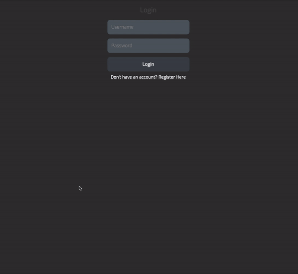

# shopping-route
A web application that allows users to log their grocery items by name and the corresponding isle location. At a later time, the user can select which items they need and the app will put the items in order depending on their isle location, resulting in the shortest path to retrieve all grocery items.

## Getting Started

* npm run start
* Go to http://localhost:3000/

## Built With

* [EJS](https://ejs.co/) - Embedded JavaScript Templating
* [Mongoose](https://mongoosejs.com/) - Database
* [Express](https://expressjs.com/) - Backend
* [Passport.js] (http://www.passportjs.org/) - User Authentication

# Demo

